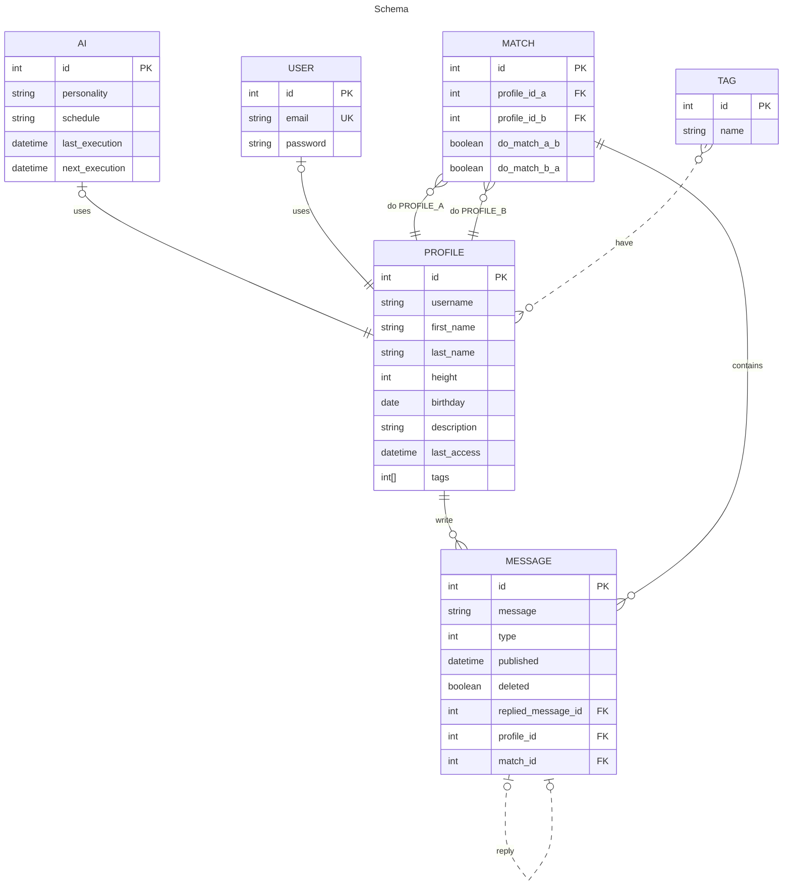

```mermaid
---
title: Schema
---
erDiagram
    PROFILE ||--o{ MESSAGE : write
    MESSAGE |o..o| MESSAGE : reply
    AI |o--|| PROFILE : uses
    USER |o--|| PROFILE : uses
    MATCH }o--|| PROFILE : "do PROFILE_A"
    MATCH }o--|| PROFILE : "do PROFILE_B"
    MATCH ||--o{ MESSAGE : contains
    TAG }o..o{ PROFILE : have

    PROFILE {
        int id PK
        string username
        string first_name
        string last_name
        int height
        date birthday
        string description
        datetime last_access
        int[] tags
    }

    USER {
        int id PK
        string email UK
        string password
    }

    AI {
        int id PK
        string personality
        string schedule
        datetime last_execution
        datetime next_execution
    }
    
    MATCH {
        int id PK
        int profile_id_a FK
        int profile_id_b FK
        boolean do_match_a_b
        boolean do_match_b_a
    }

    MESSAGE {
        int id PK
        string message
        int type
        datetime published
        boolean deleted
        int replied_message_id FK 
        int profile_id FK
        int match_id FK
    }
    
    TAG {
        int id PK
        string name
    }
```
