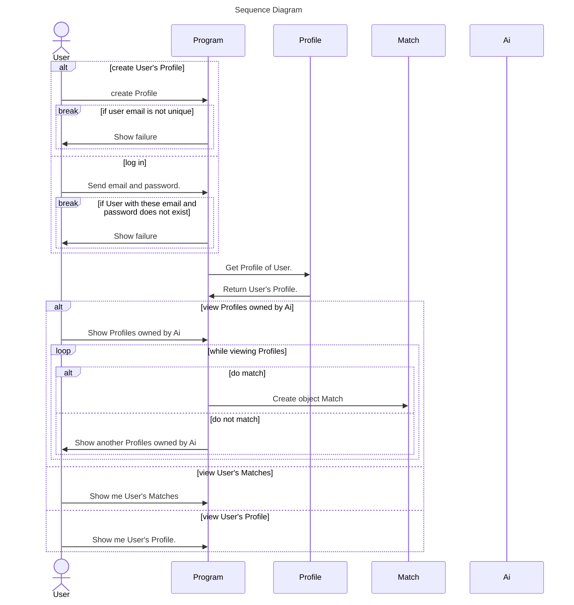

```mermaid
---
title: Sequence Diagram
---
sequenceDiagram
actor User
participant Program
participant Profile
participant Match
participant Ai

alt create User's Profile
    User->>Program: create Profile
    break if user email is not unique
        Program->>User: Show failure
    end
else log in
    User->>Program: Send email and password.
    break if User with these email and password does not exist
        Program->>User: Show failure
    end
end

Program->>Profile: Get Profile of User.
Profile->>Program: Return User's Profile.

alt view Profiles owned by Ai
    User->>Program: Show Profiles owned by Ai
    loop while viewing Profiles
        alt do match
            Program->>Match: Create object Match
        else do not match
            Program->>User: Show another Profiles owned by Ai
        end
    end
else view User's Matches
    User->>Program: Show me User's Matches
    
else view User's Profile
    User->>Program: Show me User's Profile.
end


```