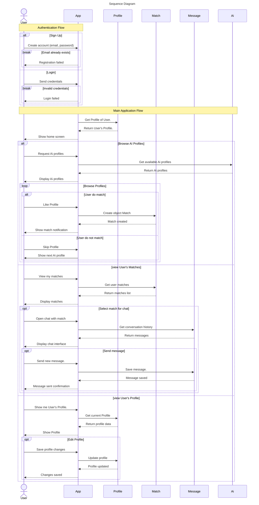

```mermaid
---
title: Sequence Diagram
---
sequenceDiagram
actor User
participant App
participant Profile
participant Match
participant Message
participant Ai

Note over User, App: Authentication Flow
alt Sign Up
    User->>App: Create account (email, password)
    break Email already exists
        App-->>User: Registration failed
    end
else Login
    User->>App: Send credentials
    break Invalid credentials
        App-->>User: Login failed
    end
end

Note over User, Ai: Main Application Flow
App->>Profile: Get Profile of User.
Profile-->>App: Return User's Profile.
App-->>User: Show home screen

alt Browse AI Profiles
    User->>App: Request Ai profiles
    App->>Ai: Get available Ai profiles
    Ai-->>App: Return Ai profiles
    App-->>User: Display Ai profiles

    loop Browse Profiles
        alt User do match
            User->>App: Like Profile
            App->>Match: Create object Match
            Match-->>App: Match created
            App-->>User: Show match notification
        else User do not match
            User->>App: Skip Profile
            App->>User: Show next Ai profile
        end
    end

else view User's Matches
    User->>App: View my matches
    App->>Match: Get user matches
    Match-->>App: Return matches list
    App-->>User: Display matches

    opt Select match for chat
        User->>App: Open chat with match
        App->>Message: Get conversation history
        Message-->>App: Return messages
        App-->>User: Display chat interface

        opt Send message
            User->>App: Send new message.
            App->>Message: Save message.
            Message-->>App: Message saved
            App-->>User: Message sent confirmation
       end
    end

else view User's Profile
    User->>App: Show me User's Profile.
    App->>Profile: Get current Profile
    Profile-->>App: Return profile data
    App-->>User: Show Profile

    opt Edit Profile
        User->>App: Save profile changes
        App->>Profile: Update profile
        Profile-->>App: Profile updated
        App-->>User: Changes saved
    end
end
```
